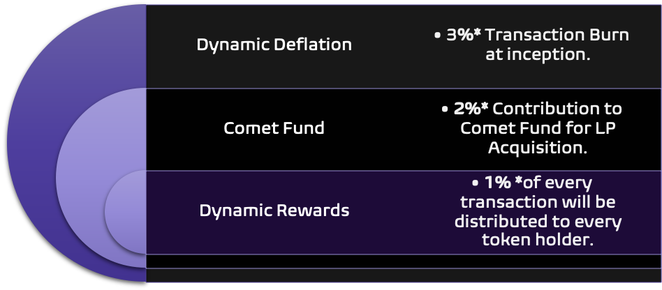

# The Comet Fund

The star of $SQUID token is the Comet Fund which is a multilayer pooled equity fund. This unique feature will turn transaction volume into returns for our investors through direct reinvestment and static rewards.

The comet fund contains an amalgamation of investments into large-cap, mid-cap and small-cap defi projects which will backed with locked liquidity pairs against the $SQUID token. Assets will be purchased dynamically guided by market conditions, technical analysis, and consideration of several  key macroeconomic factors.

&#x20;

One token with exposure to Bitcoin, Ethereum and the whole defi universe.

Gain exposure to multiple mid to large-cap coins without worrying about entry points or take profits. Our fund is managed by a team that constantly monitors market conditions to provide the best entry and exit points with an effort to maximize crypto holdings while maintaining a steady pool of stablecoin. Acquired liquidity will be locked and paired to SQUID as we continuously convert transaction volume to our reserves of cryptoassets.
